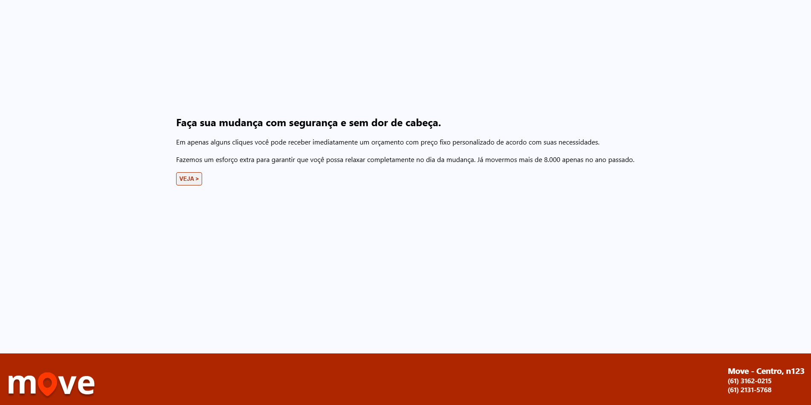
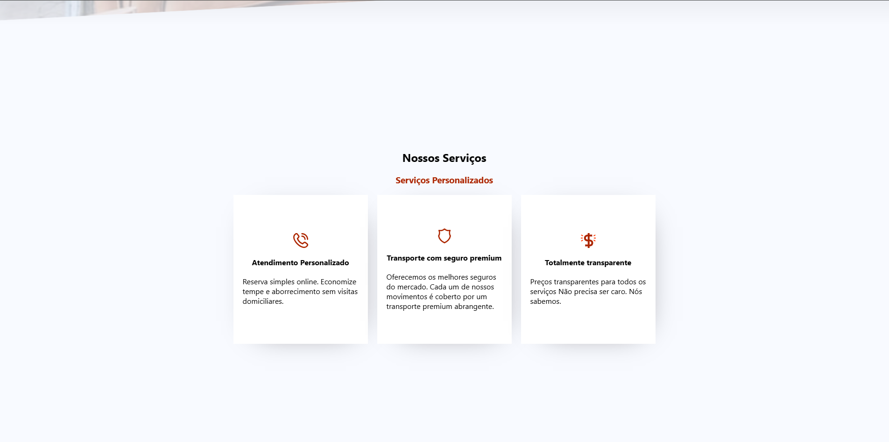
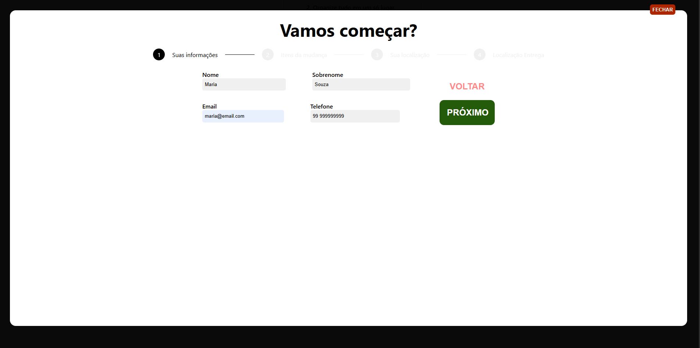
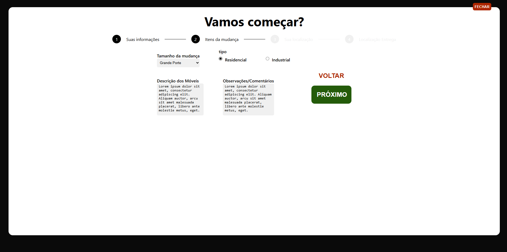
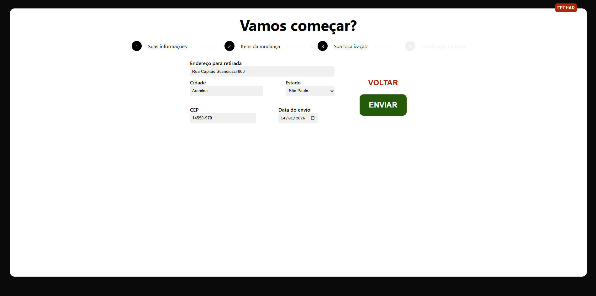
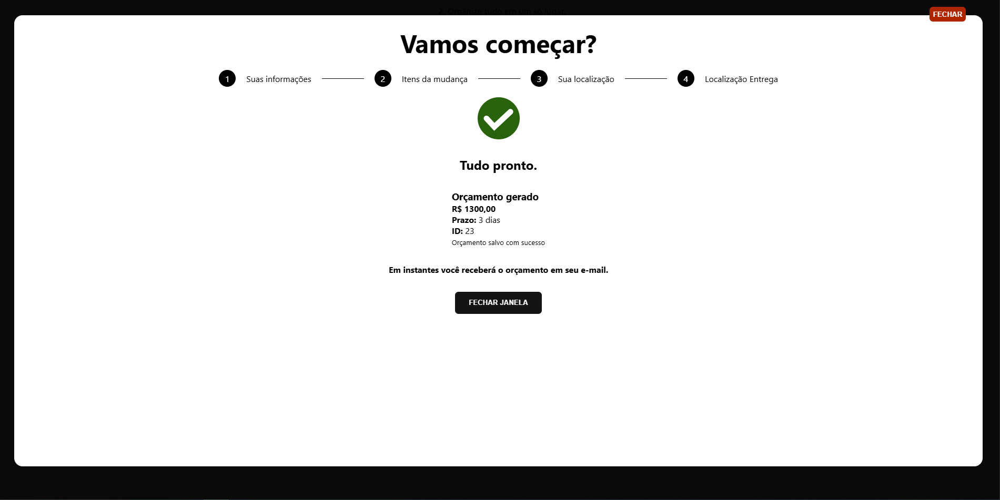
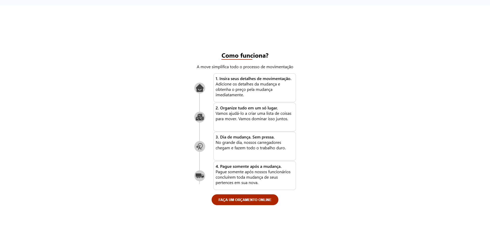
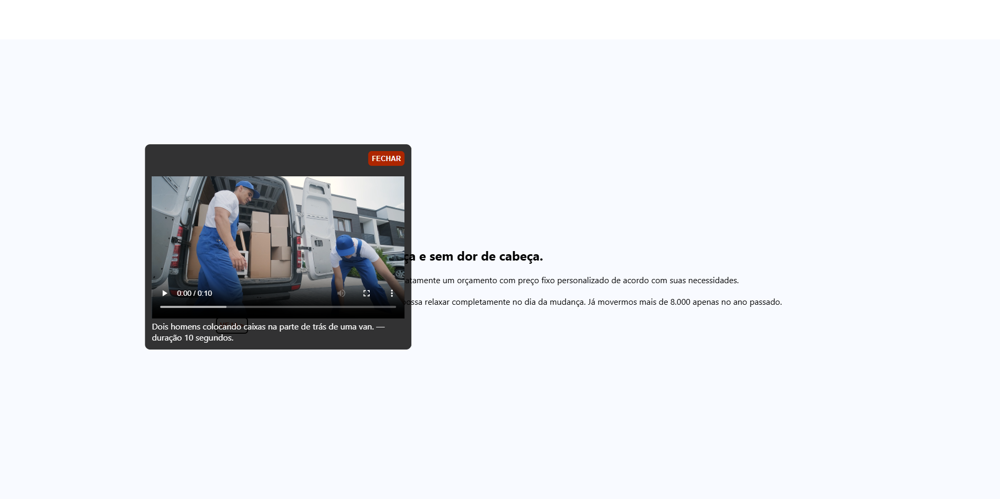

# Move 

Aplicação front-end para simulação e visualização de orçamento pessoal. O foco do projeto é **React + TypeScript**, organização de código, boas práticas e clareza de UI.

##  Objetivo

Permitir que o usuário informe seus dados pessoais e detalhes da mudança para visualizar um **orçamento de mudança** de forma simples e direta. Projeto pensado para **portfólio**, priorizando legibilidade, tipagem e estrutura.

##  Escopo do Projeto

* Simulação de orçamento de mudança
* Coleta de dados do usuário:

  * Nome e sobrenome
  * Email e telefone
  * Endereço completo
  * Descrição dos móveis
* Cálculo e exibição do valor final do orçamento
* Separação clara entre lógica e UI
* Código escalável e fácil de manter

##  Tecnologias

* React
* TypeScript
* Vite
* CSS Modules
* API mock (MockAPI)

##  Estrutura de Pastas

```
src/
├─ api/           # Configuração de chamadas HTTP
├─ components/    # Componentes reutilizáveis
├─ pages/         # Páginas da aplicação
├─ hooks/         # Hooks customizados
├─ types/         # Tipagens globais
├─ styles/        # Estilos globais
└─ main.tsx
```

##  Fluxo da Aplicação

1. Usuário preenche os dados pessoais e informações da mudança
2. Os dados são processados no front-end
3. O orçamento é calculado
4. O valor final é exibido na interface

##  Decisões Técnicas

* **TypeScript** para garantir segurança e previsibilidade
* **CSS Modules** para evitar conflitos de estilo
* **MockAPI** para simular consumo de API real
* Context será utilizado apenas se houver compartilhamento real de estado

##  Como Rodar o Projeto

```bash
cd move
npm install
npm run dev
```

##  Status do Projeto

Em desenvolvimento. Projeto em evolução contínua com foco em aprendizado e portfólio.

##  Imagens 📸

Abaixo estão capturas de tela e ilustrações da aplicação (disponíveis em `docs/images`):

<table>
  <tr>
    <td align="center">
      <br>
      <small>Header</small>
    </td>
    <td align="center">
      <br>
      <small>Move</small>
    </td>
    <td align="center">
      <br>
      <small>Services</small>
    </td>
  </tr>
  <tr>
    <td align="center">
      <br>
      <small>Step1</small>
    </td>
    <td align="center">
      <br>
      <small>Step2</small>
    </td>
    <td align="center">
      <br>
      <small>Step3</small>
    </td>
  </tr>
  <tr>
    <td align="center">
      <br>
      <small>Step4</small>
    </td>
    <td align="center">
      <br>
      <small>Steps</small>
    </td>
    <td align="center">
      <br>
      <small>Video modal</small>
    </td>
  </tr>
</table>

---

Feito para consolidar conhecimentos em **React + TypeScript** e demonstrar organização de código no front-end.
